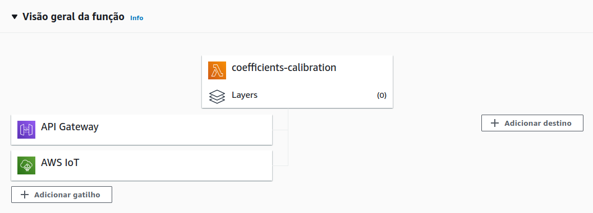

# temp-sensor

<p align="center">Project that simulates a temperature sensor sendind data to a cloud server and receive calibration coefficients.</p>

### Build Project

```bash
# Build docker container as temp-sensor app
$ docker build --tag temp-sensor .

# Run app
$ docker run temp-sensor
```

### AWS IoT Core

---

The following rules were used :


- sensor_temperature_db: A rule that receive all messages from the sensor by topic (sensor/data) and save them on dynamo database with message time

- republish_calibration_coefficients: A rule that republish on topic (sensor/data/calibration) the message recieved from lambda function by a topic (calibration) that calculate the coefficients

- call_calibration: A rule that call a lambda function (coefficients-calibration), who get data from database and calculate coefficients calibration, and return it as a message

### AWS IoT Core

---

The following rules were used :



- Lambda function used to get data from DynamoDb, calculate coeficient calibration and send back to IoT Core as a message by a topic (calibration)

```
const AWS = require('aws-sdk');
const awsIot = require('aws-iot-device-sdk')
const ss = require('simple-statistics');

let dynamodb = new AWS.DynamoDB.DocumentClient();

const iotData = new AWS.IotData({ endpoint: 'a27sf0y6gli8so-ats.iot.us-west-2.amazonaws.com' });


exports.handler = async (event, callback) => {

    let x_axis = [];
    let y_axis = [];
    let coordenate_pair = [];

    const params = {
      TableName: "temperature_data"
    };

    let scanResults = [];
    let items;

   //Get it item from table temperature_data and push it to scanResults array
    do {
        items = await dynamodb.scan(params).promise();
        items.Items.forEach((item) => scanResults.push(item));
        params.ExclusiveStartKey = items.LastEvaluatedKey;
    } while (typeof items.LastEvaluatedKey != "undefined");

   //Filter temperature data from all items gotten on scan
    for(let i = 0; i < scanResults.length; i++){
        x_axis.push(i)
        y_axis.push(scanResults[i].temperature.temperature)
    }

    //Build pair of coordenates with x_axix being time and x_axis being temperature
    for(let i = 1; i < x_axis.length; i++) {
        coordenate_pair.push([x_axis[i] , y_axis[i]])
    }

    //Use a linear regression function, passing coordenate_pair array as parameter
    const coefficients = await ss.linearRegression(coordenate_pair);

    //Build a parameter with topic and the payload to send to IoT Core
    const params2 = {
        topic: "calibration",
        payload: JSON.stringify(coefficients),
        qos: 1,
    }

    //Publish message to Iot Core
    await iotData.publish(params2, (err, res) => {
    if (err) {
     console.log("Error publishing to IOT")
      return null
    };

  }).promise()

};
```

### Technologies and libs

---

The following tools were used in building the project:

- [Node.js](https://nodejs.org/en/)
- [Docker](https://www.docker.com/)
- [AWS](https://aws.amazon.com/pt/)
- [aws-iot-device-sdk-js](https://github.com/aws/aws-iot-device-sdk-js)
- [simple-statistics](https://github.com/simple-statistics/simple-statistics)
- [chance](https://chancejs.com/usage/node.html)

### Autor

---

Made by Vinícius Adriano.

LikedIn: https://www.linkedin.com/in/vinicius-adriano-26a74713b/<br />
GitHub: https://github.com/viniciusarsouza
